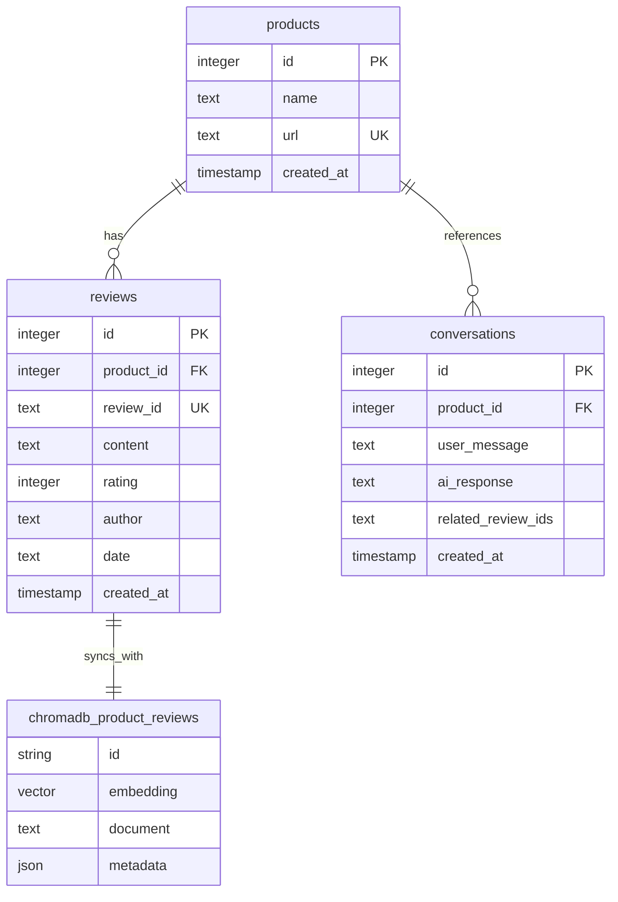

# ERD.md

ReviewTalk Backend 데이터베이스 설계 문서

## 데이터베이스 아키텍처 개요

ReviewTalk 백엔드는 **하이브리드 데이터베이스 아키텍처**를 사용합니다:

1. **SQLite Database** (`reviewtalk.db`) - 구조화된 관계형 데이터 저장
2. **ChromaDB Vector Store** - AI/ML 임베딩 및 의미적 검색

## Entity Relationship Diagram (ERD)



## 테이블 상세 설명

### 1. products 테이블
**목적**: 다나와에서 크롤링한 제품 정보를 저장

| 컬럼명 | 데이터 타입 | 제약조건 | 설명 |
|--------|-------------|----------|------|
| id | INTEGER | PRIMARY KEY, AUTO INCREMENT | 제품 고유 식별자 |
| name | TEXT | NOT NULL | 제품명 |
| url | TEXT | UNIQUE, NOT NULL | 다나와 제품 URL (중복 방지) |
| created_at | TIMESTAMP | DEFAULT CURRENT_TIMESTAMP | 제품 정보 최초 등록 시간 |

**비즈니스 규칙**:
- 동일한 URL의 제품은 중복 등록 불가
- 제품 삭제 시 관련 리뷰는 CASCADE 삭제됨

### 2. reviews 테이블
**목적**: 개별 제품 리뷰 데이터를 저장

| 컬럼명 | 데이터 타입 | 제약조건 | 설명 |
|--------|-------------|----------|------|
| id | INTEGER | PRIMARY KEY, AUTO INCREMENT | 리뷰 고유 식별자 |
| product_id | INTEGER | FOREIGN KEY, NOT NULL | 제품 테이블 참조 |
| review_id | TEXT | UNIQUE, NOT NULL | 다나와 리뷰 고유 ID |
| content | TEXT | NOT NULL | 리뷰 텍스트 내용 |
| rating | INTEGER | NULL | 평점 (1-5점) |
| author | TEXT | NULL | 리뷰 작성자명 |
| date | TEXT | NULL | 리뷰 작성일 |
| created_at | TIMESTAMP | DEFAULT CURRENT_TIMESTAMP | 리뷰 저장 시간 |

**외래키 관계**:
- `product_id` → `products(id)` ON DELETE CASCADE

**비즈니스 규칙**:
- 동일한 review_id는 전체 시스템에서 유일해야 함
- 제품 삭제 시 해당 제품의 모든 리뷰 삭제
- ChromaDB와 동기화되어 벡터 검색 가능

### 3. conversations 테이블
**목적**: 사용자와 AI 간의 대화 기록을 저장

| 컬럼명 | 데이터 타입 | 제약조건 | 설명 |
|--------|-------------|----------|------|
| id | INTEGER | PRIMARY KEY, AUTO INCREMENT | 대화 고유 식별자 |
| product_id | INTEGER | FOREIGN KEY, NULL | 제품 테이블 참조 (선택적) |
| user_message | TEXT | NOT NULL | 사용자 질문/입력 |
| ai_response | TEXT | NOT NULL | AI 생성 답변 |
| related_review_ids | TEXT | NULL | 답변 생성에 사용된 리뷰 ID 목록 (쉼표 구분) |
| created_at | TIMESTAMP | DEFAULT CURRENT_TIMESTAMP | 대화 발생 시간 |

**외래키 관계**:
- `product_id` → `products(id)` ON DELETE SET NULL

**비즈니스 규칙**:
- 제품과 무관한 일반적인 대화도 저장 가능 (product_id NULL)
- 제품 삭제 시 대화 기록은 유지되지만 product_id는 NULL로 설정

### 4. ChromaDB Vector Store

#### Collection: product_reviews
**목적**: 리뷰 내용의 벡터 임베딩을 저장하여 의미적 검색 지원

| 필드명 | 타입 | 설명 |
|--------|------|------|
| id | string | `"review_{review_id}"` 형식 |
| embedding | vector | 다국어 임베딩 모델 벡터 |
| document | text | `"평점: {rating}/5\n리뷰: {content}"` 형식 |
| metadata | json | 제품 URL, 평점, 날짜, 리뷰 ID, 작성자 정보 |

**사용 모델**: `intfloat/multilingual-e5-small`

**메타데이터 구조**:
```json
{
    "product_url": "제품 URL",
    "rating": "평점 (정수)",
    "date": "작성일",
    "review_id": "리뷰 고유 ID",
    "author": "작성자명"
}
```

## 데이터 플로우

### 1. 제품 리뷰 크롤링 플로우
```
1. 사용자가 제품 URL 입력
2. products 테이블에 제품 정보 저장 (중복 체크)
3. 다나와에서 리뷰 크롤링
4. reviews 테이블에 리뷰 저장
5. ChromaDB에 리뷰 벡터화하여 저장
```

### 2. AI 채팅 플로우
```
1. 사용자 질문 입력
2. ChromaDB에서 관련 리뷰 벡터 검색
3. 검색된 리뷰 기반으로 AI 답변 생성
4. conversations 테이블에 대화 기록 저장
```

## 인덱스 및 성능 최적화

### 권장 인덱스
```sql
-- 제품 URL 기반 빠른 검색
CREATE UNIQUE INDEX idx_products_url ON products(url);

-- 제품별 리뷰 조회 최적화
CREATE INDEX idx_reviews_product_id ON reviews(product_id);

-- 리뷰 ID 기반 빠른 검색
CREATE UNIQUE INDEX idx_reviews_review_id ON reviews(review_id);

-- 대화 기록 시간순 조회
CREATE INDEX idx_conversations_created_at ON conversations(created_at DESC);
```

## 데이터 무결성 규칙

1. **참조 무결성**:
   - reviews.product_id는 반드시 존재하는 제품을 참조
   - conversations.product_id는 NULL 허용 (제품 무관 대화)

2. **고유성 제약**:
   - products.url은 전역적으로 유일
   - reviews.review_id는 전역적으로 유일

3. **동기화 규칙**:
   - SQLite의 reviews와 ChromaDB의 product_reviews는 review_id로 동기화
   - 리뷰 삭제 시 두 저장소에서 모두 제거

## 확장성 고려사항

### 1. 스케일링 준비
- 대용량 리뷰 데이터 처리를 위한 파티셔닝 고려
- 읽기 전용 복제본을 통한 성능 향상
- 벡터 검색 성능 최적화

### 2. 미래 확장 가능 필드
- reviews 테이블: `helpful_count`, `verified_purchase` 등
- products 테이블: `category`, `price`, `brand` 등
- conversations 테이블: `user_id`, `session_id` 등

## 보안 고려사항

1. **데이터 보호**:
   - 개인정보가 포함된 리뷰 내용 처리 주의
   - 사용자 대화 기록 암호화 고려

2. **접근 제어**:
   - 데이터베이스 접근 권한 최소화
   - API 레벨에서 데이터 필터링

이 ERD는 ReviewTalk의 현재 MVP 요구사항을 충족하며, 향후 기능 확장에도 유연하게 대응할 수 있도록 설계되었습니다.