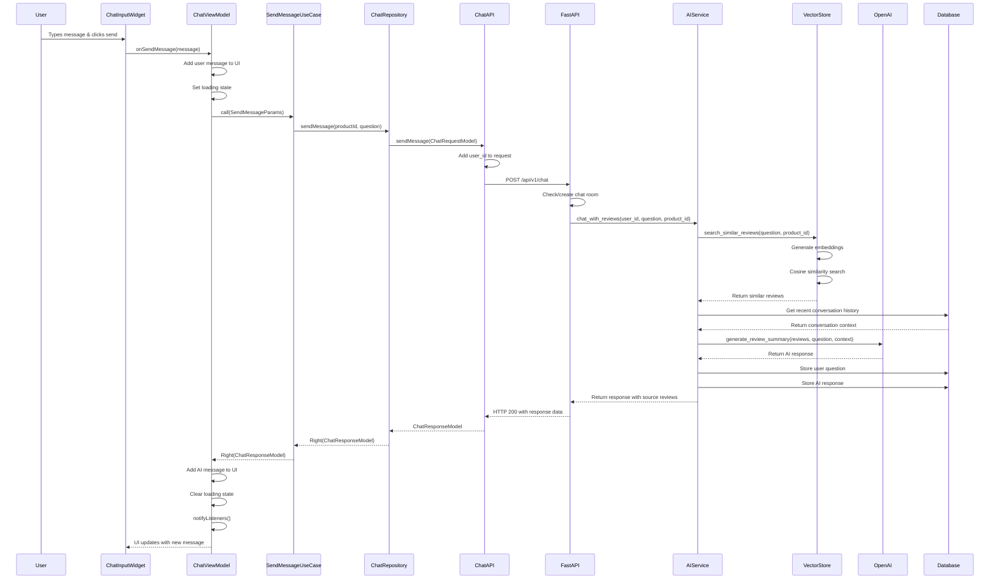

# ReviewTalk Chat Flow Analysis

## Overview
This document analyzes the complete chat message flow in the ReviewTalk application, from UI input through to backend API processing and response handling.

## Architecture Overview
The ReviewTalk app implements Clean Architecture with clear separation between:
- **Presentation Layer**: UI components and ViewModels
- **Domain Layer**: Use cases and business logic
- **Data Layer**: Repositories and API data sources
- **Backend**: FastAPI with AI services (OpenAI GPT-4 + ChromaDB)

## Related Files Analysis

### Frontend (Flutter)

#### 1. UI Layer
- **`/lib/presentation/views/screens/chat_screen.dart`**
  - Main chat screen with message display and input
  - `_buildChatInput()` function handles user input (lines 332-353)
  - Calls `viewModel.sendMessage(message)` and manages scroll behavior

- **`/lib/presentation/views/widgets/chat_input_widget.dart`**
  - Dedicated input widget with text field and send button
  - Handles input validation and loading states
  - Triggers message sending via callback

#### 2. ViewModel (Presentation Logic)
- **`/lib/presentation/viewmodels/chat_viewmodel.dart`**
  - Manages chat state and orchestrates message flow
  - `sendMessage()` method (lines 75-125) handles:
    - Immediate UI update with user message
    - API call execution with loading state
    - Response processing and AI message addition
  - Uses Provider pattern for state management

#### 3. Domain Layer
- **`/lib/domain/usecases/send_message.dart`**
  - Use case implementing business logic
  - Calls repository with structured parameters
  - Returns Either<Failure, Success> pattern for error handling

- **`/lib/domain/entities/chat_message.dart`**
  - Core chat message entity with user/AI distinction
  - Includes source reviews for AI responses

#### 4. Data Layer
- **`/lib/data/repositories/chat_repository_impl.dart`**
  - Repository implementation with comprehensive error handling
  - Converts domain entities to API models
  - Handles various exception types (Server, Network, etc.)

- **`/lib/data/datasources/remote/chat_api.dart`**
  - HTTP API client using Dio
  - Makes POST request to `/api/v1/chat`
  - 120-second timeout for AI responses
  - Automatic user ID injection

- **`/lib/data/models/chat_request_model.dart` & `chat_response_model.dart`**
  - API data transfer objects
  - JSON serialization/deserialization
  - Maps between domain entities and API format

### Backend (FastAPI)

#### 1. API Routes
- **`/app/api/routes/chat.py`**
  - REST endpoint: `POST /api/v1/chat`
  - Chat room management (creates if doesn't exist)
  - Delegates to AI service for processing

#### 2. Business Logic
- **`/app/services/ai_service.py`**
  - Core AI chat processing (lines 99-212)
  - Vector search for similar reviews
  - Conversation context management
  - OpenAI API integration
  - Database storage for conversation history

#### 3. Infrastructure
- **`/app/infrastructure/ai/vector_store.py`**
  - ChromaDB integration for semantic search
  - Uses "intfloat/multilingual-e5-small" embeddings
  - Cosine similarity search with product filtering

- **`/app/infrastructure/ai/openai_client.py`**
  - OpenAI GPT-4o integration
  - ReviewTalk-specific system prompt
  - Conversation context handling

#### 4. Data Persistence
- **`/app/infrastructure/chat_room_repository.py`**
  - Chat room CRUD operations
  - User-product relationship management

- **`/app/infrastructure/conversation_room_repository.py`**
  - Conversation history storage
  - Context retrieval for AI responses

## Sequence Diagram



## Key Data Flow Points

### 1. Request Data Structure
```dart
// Frontend Request
{
  "product_id": "12345",
  "question": "배터리 성능이 어때요?",
  "user_id": "generated-uuid"
}
```

### 2. Backend Processing Steps
1. **Chat Room Management**: Ensure user-product chat room exists
2. **Vector Search**: Find 5 most similar reviews using semantic search
3. **Context Retrieval**: Get last 30 conversation messages for context
4. **AI Generation**: Generate response using GPT-4o with reviews and context
5. **Storage**: Save both user question and AI response to database
6. **Caching**: Update conversation cache for performance

### 3. Response Data Structure
```json
{
  "success": true,
  "ai_response": "🔋 배터리 성능은 대체로 만족스럽다는 평가가 많아요! 하루 종일 사용해도 충분하다는 리뷰가 많습니다.",
  "source_reviews": [
    {
      "document": "배터리 하루 종일 잘 버텨요",
      "rating": 5,
      "author": "김**"
    }
  ],
  "reviews_used": 5
}
```

## Error Handling Strategy

### Frontend Error Handling
- **NetworkException**: No internet connection
- **ServerException**: HTTP 4xx/5xx errors  
- **TimeoutException**: Request timeout (>120s)
- **ValidationException**: Invalid input data
- **UnknownException**: Unexpected errors

Each error type is handled with appropriate user feedback messages.

### Backend Error Handling
- **Database errors**: Connection and query failures
- **OpenAI API errors**: Rate limits, authentication, service unavailable
- **Vector store errors**: ChromaDB connection issues
- **Validation errors**: Request data validation failures

## Performance Optimizations

1. **Caching**: Conversation history cached for faster context retrieval
2. **Timeout Management**: 120-second timeout for AI response generation
3. **Batch Processing**: Multiple database operations in single transaction
4. **Connection Pooling**: Reuse database connections
5. **Lazy Loading**: Load conversation history on demand

## State Management

The application uses Provider pattern with:
- **Loading States**: Show spinner during API calls
- **Error States**: Display error messages to users
- **Success States**: Update UI with new messages
- **Reactive Updates**: Automatic UI refresh via `notifyListeners()`

## Security Considerations

1. **User ID Management**: Automatic UUID generation and storage
2. **API Timeout**: Prevent hanging requests
3. **Input Validation**: Sanitize user input at multiple layers
4. **Error Sanitization**: Don't expose internal error details to users
5. **Rate Limiting**: Backend implements request throttling

## Technical Debt & Improvements

1. **Hard-coded Values**: Some timeout values and constants could be configurable
2. **Error Messages**: More specific error messages for different failure scenarios
3. **Retry Logic**: Automatic retry for transient failures
4. **Message Persistence**: Local storage for offline message viewing
5. **Real-time Updates**: WebSocket for live message updates
6. **Message Pagination**: Load older messages on demand

---

**Analysis Date**: 2025-06-20  
**Architecture**: Clean Architecture with Provider State Management  
**Backend**: FastAPI + OpenAI GPT-4o + ChromaDB Vector Store  
**Frontend**: Flutter with Dio HTTP Client