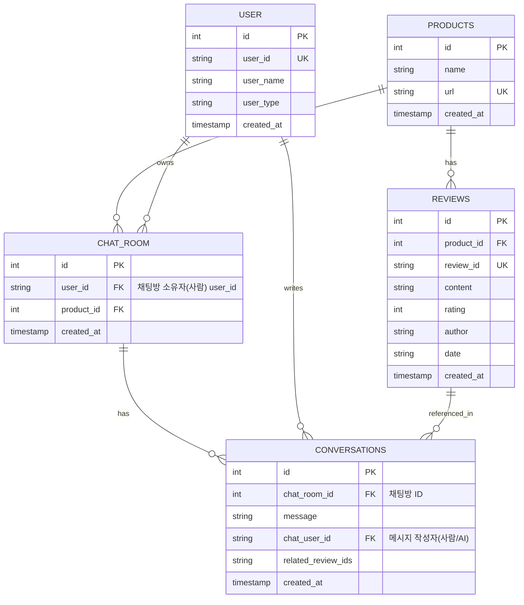

# PROJECT_OVERVIEW 

---

## [2024-06 최신 반영] DB/엔드포인트 구조 변경 요약

- **conversations 테이블**: user_id(대화 주체, 실제 사용자) 컬럼 추가, chat_user_id(메시지 작성자, 사람/AI)와 구분
- **API**: 모든 채팅/대화 관련 엔드포인트에서 user_id 필수 파라미터화
- **캐시/DB 조회**: user_id + product_id 조합으로 대화 이력 관리
- **테스트**: user_id 기반 테스트케이스 반영

### ERD (최신)


---

## 🎯 **프로젝트 목표**

---

## 🛠️ **기술 스택**

### Backend
- **Framework**: FastAPI 0.104+
- **Language**: Python 3.11+
- **Package Manager**: uv
- **AI/ML**: 
  - OpenAI GPT-4 (주요 LLM)
  - LangChain 0.1+ (RAG 구현)
  - ChromaDB (벡터 데이터베이스)
  - Sentence-Transformers (임베딩)
- **Crawling**: 
  - Playwright (메인)
  
- **Database**: 
  - SQLite (개발 시작용)
  - PostgreSQL (확장시 - Railway 제공)
  - SQLAlchemy ORM (DB 추상화)
- **Validation**: Pydantic v2

### Frontend
- **Framework**: Flutter 3.16+
- **Language**: Dart 3.2+
- **Architecture**: MVVM + Clean Architecture
- **State Management**: Provider 6.1+
- **HTTP**: dio 5.4+
- **Dependency Injection**: get_it 7.6+
- **Local Storage**: shared_preferences, hive

### DevOps & Tools
- **Package Manager**: uv (Python 의존성 관리)
- **Deployment**: 
  - Backend: Railway - GitHub 자동 배포
  - Database: Railway PostgreSQL (무료)
  - Frontend: APK 직접 배포
- **Version Control**: Git + GitHub

---

## 🏗️ **아키텍처 설계**

### 전체 구조도
```
┌─────────────────┐    API    ┌──────────────────┐
│   Flutter App   │ ◄────────► │   FastAPI Server │
│     (MVVM)      │            │      (Clean)     │
└─────────────────┘            └──────────────────┘
         │                              │
         ▼                              ▼
┌─────────────────┐            ┌──────────────────┐
│ Local Storage   │            │  Vector Database │
│ (SharedPrefs)   │            │     (ChromaDB)   │
└─────────────────┘            └──────────────────┘
```

### 백엔드 폴더 구조
```
reviewtalk-backend/
├── app/
│   ├── main.py                   # FastAPI 앱 진입점
│   ├── core/                     # 핵심 설정
│   │   ├── config.py            # 환경변수, 설정
│   │   └── dependencies.py      # DI 컨테이너
│   ├── api/                     # API 엔드포인트
│   │   └── routes/
│   │       ├── crawl.py         # 크롤링 API
│   │       └── chat.py          # 챗봇 API
│   ├── services/                # 비즈니스 로직
│   │   ├── crawl_service.py     # 크롤링 서비스
│   │   └── ai_service.py        # AI 챗봇 서비스
│   ├── models/                  # 데이터 모델
│   │   └── schemas.py           # Pydantic 스키마
│   ├── infrastructure/          # 외부 의존성
│   │   ├── crawler/
│   │   │   └── danawa_crawler.py
│   │   └── ai/
│   │       ├── openai_client.py
│   │       └── chroma_store.py
│   └── utils/
│       └── exceptions.py
├── pyproject.toml
└── .env
```

### 프론트엔드 폴더 구조 (MVVM)
```
reviewtalk-app/
├── lib/
│   ├── main.dart                 # 앱 진입점
│   ├── core/                     # 핵심 기능
│   │   ├── constants/           # 상수
│   │   ├── network/             # 네트워크
│   │   └── utils/               # 유틸리티
│   ├── data/                     # 데이터 레이어
│   │   ├── datasources/remote/  # API 클라이언트
│   │   ├── models/              # 데이터 모델
│   │   └── repositories/        # 리포지토리 구현
│   ├── domain/                   # 도메인 레이어
│   │   ├── entities/            # 도메인 엔티티
│   │   ├── repositories/        # 리포지토리 인터페이스
│   │   └── usecases/            # 유스케이스
│   ├── presentation/             # 프레젠테이션 레이어
│   │   ├── viewmodels/          # ViewModel (MVVM)
│   │   └── views/               # View (UI)
│   │       ├── screens/
│   │       └── widgets/
│   └── injection_container.dart  # 의존성 주입
└── pubspec.yaml
```

### 프레젠테이션 레이어 구조
```
presentation/
├── viewmodels/
│   ├── product_viewmodel.dart     # 상품 크롤링 상태관리
│   └── chat_viewmodel.dart        # AI 채팅 상태관리
└── views/
    ├── screens/
    │   ├── home_screen.dart       # URL 입력 화면
    │   ├── loading_screen.dart    # 크롤링 진행 화면  
    │   └── chat_screen.dart       # AI 채팅 화면
    └── widgets/
        ├── product_url_input.dart # URL 입력 위젯
        ├── chat_bubble.dart       # 채팅 말풍선 위젯
        └── loading_indicator.dart # 로딩 인디케이터
```

---

## 🎯 **오늘의 최종 목표**

### **완성 목표:**
- ✅ 다나와 URL 입력 → 리뷰 크롤링 성공
- ✅ "배터리 어때요?" → AI 답변 생성
- ✅ Flutter 앱에서 전체 플로우 실행 가능
- ✅ 안드로이드 에뮬레이터에서 데모 시연 가능
- ✅ Railway에 백엔드 배포
- ✅ APK 파일 생성

### **핵심 API 엔드포인트:**
```
POST /api/v1/crawl-reviews
POST /api/v1/chat
GET  /health
```

### **환경변수:**
```
OPENAI_API_KEY=sk-your-key-here
CORS_ORIGINS=*
DATABASE_URL=sqlite:///./reviewtalk.db
```

이 문서는 모든 체크포인트에서 참조용으로 사용하세요!

---

## 📑 API 명세 (2024-06 최신)

### 1. AI 채팅 (상품 리뷰 기반)

- **POST /api/v1/chat**
- **설명:** 상품 리뷰 기반 AI 답변 생성
- **요청 JSON:**
```json
{
  "user_id": "string",         // 사용자 ID (필수)
  "product_id": "string",      // 상품 ID (선택)
  "question": "string"         // 사용자 질문 (필수)
}
```
- **응답 예시:**
```json
{
  "success": true,
  "ai_response": "이 상품의 장점은 ...",
  "source_reviews": [ ... ],
  "reviews_used": 5
}
```

### 2. 대화 인터페이스 (AI+크롤링 통합)

- **POST /api/v1/conversation**
- **설명:** AI 답변 + (옵션) 리뷰 크롤링 통합
- **요청 파라미터:**
  - user_id: string (필수)
  - user_question: string (필수)
  - product_id: string (선택)
  - crawl_request: CrawlRequest (선택, JSON)
- **응답 예시:**
```json
{
  "success": true,
  "chat_result": { ... },
  "crawl_result": { ... },
  "message": "대화 인터페이스 처리 완료"
}
```

### 3. 제품 전체 리뷰 요약
- **GET /api/v1/product-overview?product_url=...**
- **설명:** 해당 상품의 전체 리뷰 요약

### 4. 벡터 DB 통계
- **GET /api/v1/database-stats**
- **설명:** 벡터 DB(Chroma) 내 리뷰 통계

---

### 📦 주요 스키마 (Pydantic)

#### ChatRequest
```python
class ChatRequest(BaseModel):
    user_id: str
    product_id: Optional[str]
    question: str
```

#### ChatResponse (예시)
```python
class ChatResponse(BaseModel):
    success: bool
    answer: str
    confidence: float
    source_reviews: List[SourceReview]
    error_message: Optional[str]
```

#### CrawlRequest
```python
class CrawlRequest(BaseModel):
    product_url: HttpUrl
    max_reviews: int
```

---

**모든 엔드포인트는 user_id를 필수로 받으며, 응답은 success/에러 메시지/AI 답변/참조 리뷰 등 구조화되어 반환됩니다.**