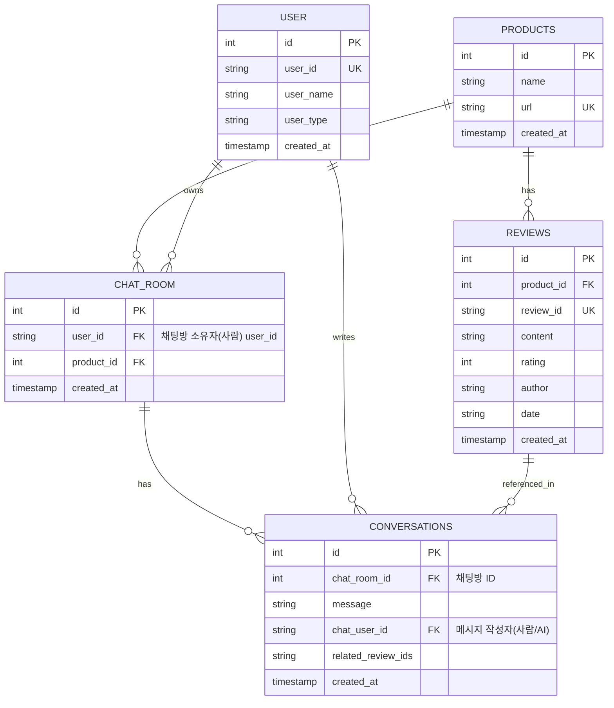

# ERD (Entity Relationship Diagram)

## ReviewTalk DB 구조 (최신)

## 설명
- USER: 사람/AI 모두 포함, user_type으로 구분
- CONVERSATIONS: user_id(대화 주체, 실제 사용자), chat_user_id(메시지 작성자, 사람/AI), 관련 리뷰 ID, 생성일 등 저장
- PRODUCTS, REVIEWS: 기존과 동일
- user_id + product_id 조합으로 대화 캐시 및 조회 